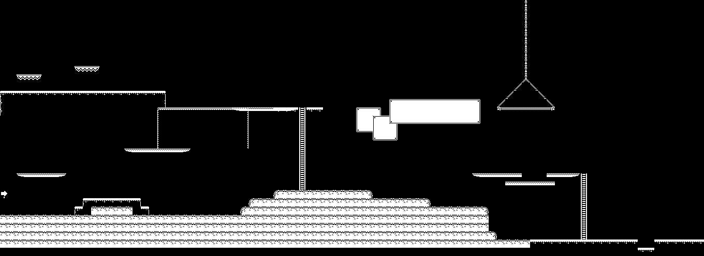
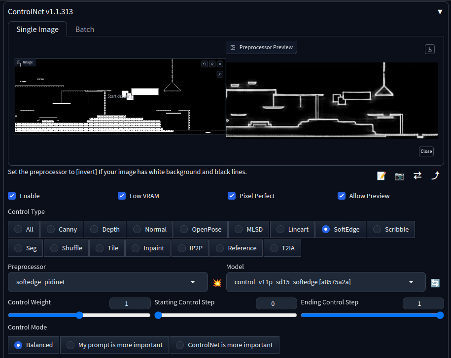
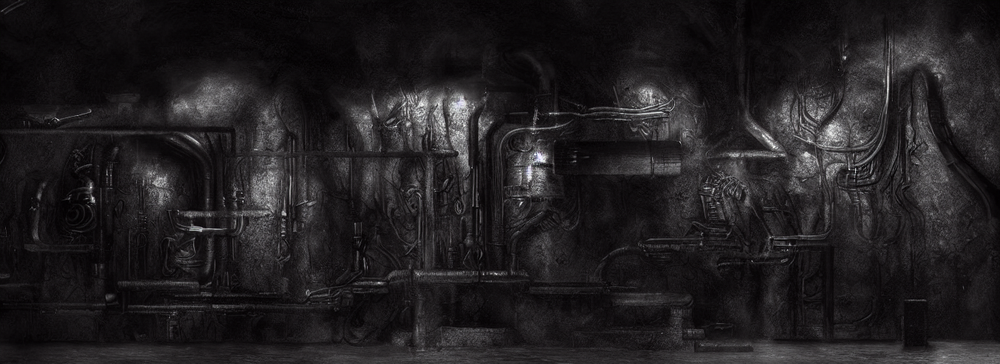
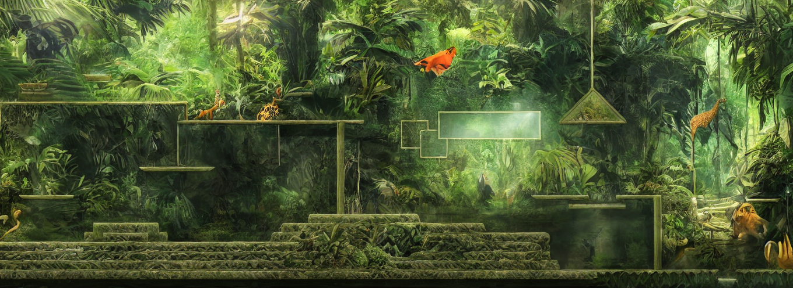
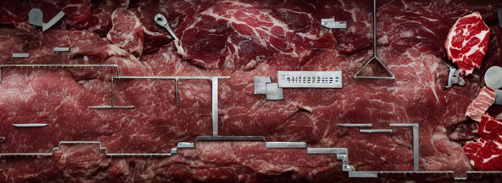
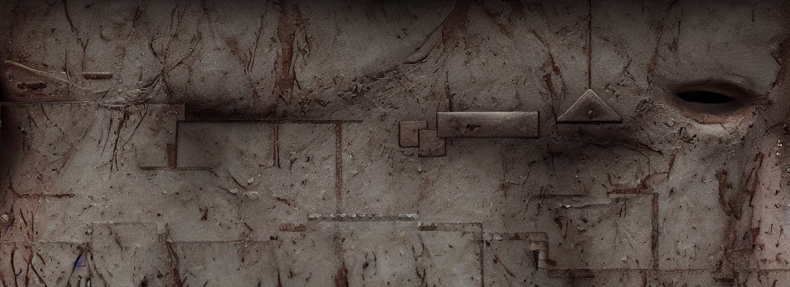
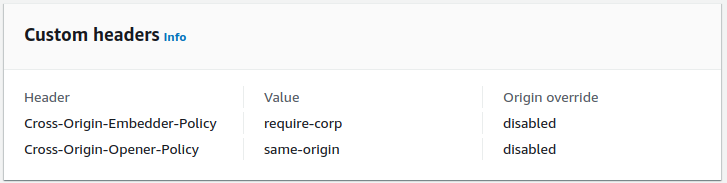

# Gen AI Pixel Perfect 2D Backgrounds in Godot4

This is the godot4 project to go with the GIC 2023 talk, along with some supporting scripts for setting up a StableDiffusion g5.2xlarge server in AWS, and deploying a web build to Amazon S3 + Amazon Cloudfront.

## Overview

Using a combination of TileMaps in Godot4, StableDiffusion, ControlNet we can generate images that lock tightly to our tilemap, but look great, based on themed prompts.

We render a tilemap out into a template such as this .

Using ControlNet , we can pre process it, extracting edge features with the pre-processor steps.

Finally, we bring this together to create our Pixel Perfect level art from themes driven by a prompt.

## Content and credits

- Music is a GoatTracker SID tune by me
- Sprites are from [1-Bit Platformer Pack by Kenney](https://kenney.nl/assets/1-bit-platformer-pack) (CC0)
- Sound Effects were made using [jsfxr](https://sfxr.me/)
- Code started off from [Brett Chalupa's 2D Platformer Template ](https://github.com/brettchalupa/godot_2d_platformer)

# Godot 4 Project

Just open and build as usual.
## *Command line options are*
-  `--render`
  - Instead or running the game, turns the tile map into a template
- `--theme=folder`
	- Only loads generated background image levels from the specified folder

## *In game commands are*
- t : toggle the tiles on and off
- c : toggle the virtual joystick on and off in the browser

## *In game controls are*
- WASD, Virtual Joystick and Arrow keys : Up, Down, Left, Right
- Space or Touch Screen click : Jump
- Esc : Back to main menu

## *What to do is*
- Get to the exit, bottom right of the level
- Every time you go through the exit, you re-spawn at the start with a new background

# Deploying to Web

## Testing locally

You need to emit the following headers for Godot 4 projects
 - `"Access-Control-Allow-Origin": "*"`
 - `"Cross-Origin-Embedder-Policy": "require-corp"`
 - `"Cross-Origin-Opener-Policy", "same-origin"`

There is a helper python3 server in  [support/server.py](support/server.py).

Run it from the main directory as : `python3 support/server.py ./builds/web`.

Normally Godot 4 requires `https`, to get round this locally use `localhost` and not `0.0.0.0`.

## Using Amazon S3 and Amazon Cloudfront CDN

If you have set up a S3 bucket as a website and put Cloudfront as a CDN in front of it, there is a quick helper script to upload the files and purge the cache at : `support/deploy-web.sh`.

Run it as : `support/deploy-web.sh bucket-name cloudfront-id`.

You will need your AWS credentials set up, and the default region etc to be set, or export a profile as `export AWS_PROFILE=xyz` before running the script.

### Setting up the headers in Cloudfront
As with the local testing, you need to set up the reqired headers for the Godot 4 use of Shared Byte Arrays. In Cloudfront this is done on the **Behaviour**.

# Setting up Stable Diffusion, Control Net and Automatic111 Web UI

There is a final helper script to configure a Ubuntu 20.04 g5.2xlarge EC2 instance with everything needed.

It can be found at : `support/install-ec2.sh`.

It should be passed in as a User Data Launch script,m or run via system manager or so.

